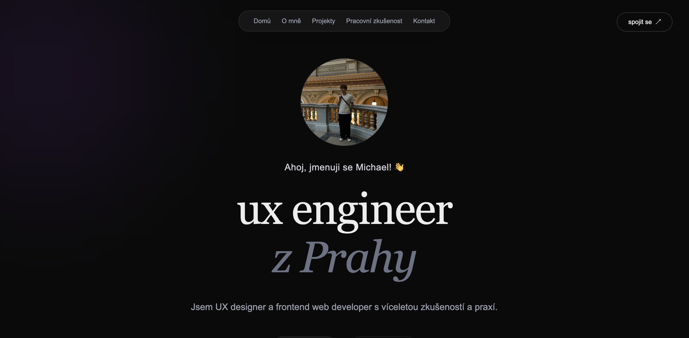

# Portfolio website

This project was made as my portfolio for my UX work. Made with Next.js with extra caution for excelent SEO optimalization.
 

[Live project](https://www.michaelptacek.com/)

## Techstack 
* React.js
* Next.js
* Tailwind CSS
* Framer Motion
* NodeMailer
* Vercel
* Microsoft Clarity (For UX analysis)

## How to install and run this project
Make sure you have [Node.js](https://nodejs.org/) installed.

1. Clone this repository
2. Install dependencies: 
`npm install`
3. Start the development server: 
`npm run dev`

made by [Michael Ptáček](https://michaelptacek.com)